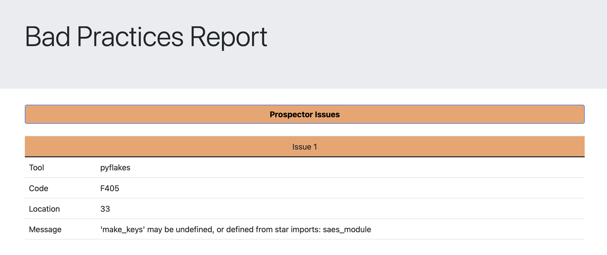
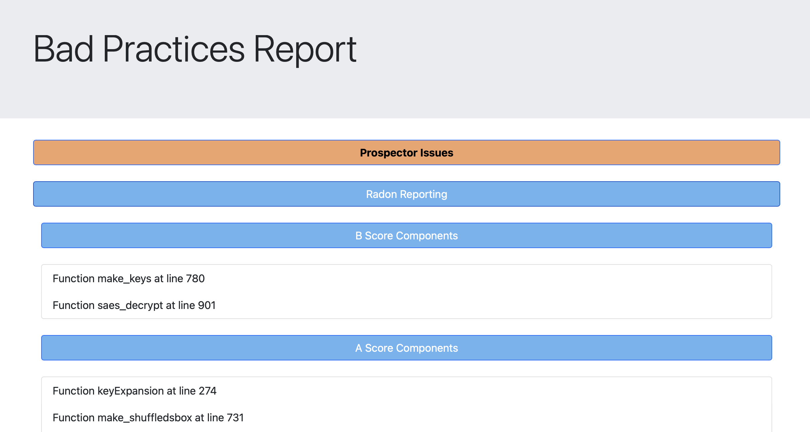

# Security pipeline bad practices documentation
This document will serve as documentation for the bad practices part of the pipeline

## Author
	Dinis Cruz

## Objectives
Catch code smells and possible bugs within the code

## Tools considered
When doing the initial tools research, the objective was always to create the most versatile solution possible. This versatility would come from being as easy to maintain as possible and preferably using open source solutions.

### Sonarqube
Possibly the most known tool for the job, offers a good range of vulnerabilities for a vast range of languages.
It also offers an intuitive way to implement within a CI pipeline, in our case, Github Actions.
The downside of this tool is the pricing for the developed edition and even though it is integrated with GitHub, this integration is oriented to having the sonarqube panel to better understand results from failed jobs.

### Codacy
Much like sonarqube, this tool offers mostly the same features. The same great things about them is there, but the princing (This tool does not have a free version) and the orientation to a web portal showing all types of metrics, pose the same problems as above.

### CodeQL
This is GitHub's approach to code quality within their product, being a GitHub integrated solution as a lot of nice quality of of life features. These include the showing of problems within the interface, and little to no effort in enabling the tool.
Unfortunately this tool has a price if we wish to use it in private repositories, this is clearly the best tool for a GitHub integrated solution, as it offers the compilation of multiple tools (like codacy) to do the job, if public repositories aren't a problem, this was not the case.

### A plethora of smaller python solutions
These include:

	Pylint
	Pyflakes
	PEP8
	Radon
	mccabe
	...

All of these tools, with some nuances, offer a simple command line approach to code style, code complexity metrics and code smells or potential bugs.
These are open-source solutions, that can be integrated with GitHub actions as they can be installed fairly easily and ran against the repositories code.

### Prospector
This tool is a compilation of some of the tools presented right above, these include:

	Pylint
	Pycodestyle
	Pyflakes
	Mccabe
	Dodgy
	Pydocstyle

Some of these are more oriented to finding code smells or bugs while others are more interested in styling problems.
Having this being an open-source compilation of tools, that runs as a command line tool, as a compilation of other highly rated simpler tools for the objective it seemed like the better option.

### Radon
During the search for these tools, radon showed up as tool capable of calculating if functions, classes of methods, where too complex, and considering code efficiency and readability are also important metrics, this tool was added to the pipeline as it can complement prospector with code complexity metrics. This is also an open-source command line tool.

## Job description
- Install [prospector](https://prospector.landscape.io/en/master/)
- Install [radon](https://radon.readthedocs.io/en/latest/)
- For all files to be analysed, that end in .py, run both prospector and radon against them
- Move the reports to be upload to github

## Auxiliary scripts
### InstallAndRunProspectorAndRadon.sh
Shell script that will: 

- Install both tools
- Create a directory to store all files, either temporary of final reports
- Remove the .py extension of all files
- Run both tools against it and summarises the reports using the BadPracticesReporting.py script
- Exit with 1 if issues are found, else exit with 0

Note: The strategy used to make file paths was to replace all forward-slashes (/) by backwards-slashes (\\) which makes linux read this as a file path and not a full path, but when exporting as a zip, when decompressed it creates the full paths with all directories, making the appearance much better, a happy little coincidence.

### CodeReporting.py
A parser that takes as the first argument a prospector report and as second argument a radon report.

Present only the relevant information from both reports to a html file.

This script will:
 - Read both reports passed as command line arguments
 - Sort prospector results by the line in which they can be found
 - Present relevante information (Tool that discovered the issue, Code to identify the problem, Line of the issue, and what is the issue)
 - Split radon results and make them more readable using a legend

## Ignoring issues
Some projects may want to ignore certain code smells or bugs because, they either see it as a non problem or because it would be to hard to fix, the prospector profile file allows for that sort of customisation, there is no need to re-write documentation, so their [website](https://prospector.landscape.io/en/master/profiles.html) shows all options needed.

## Example output
### Prospector results

### Radon results

