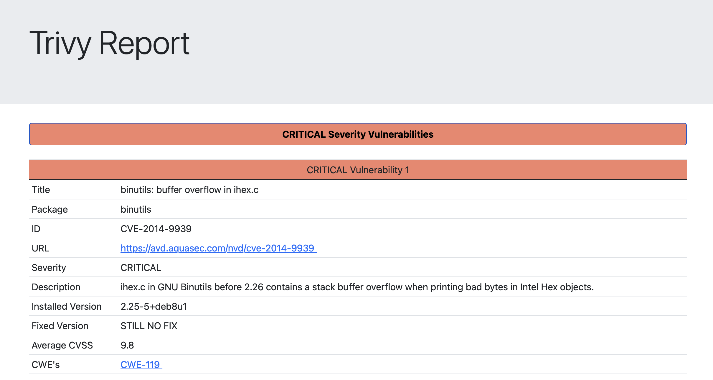
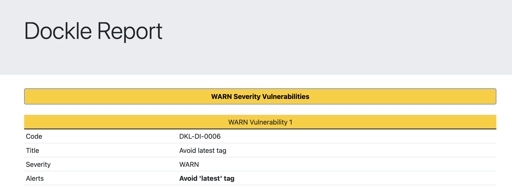

# Security pipeline container scanning documentation
This document will serve as documentation for the container scanning part of the pipeline

## Author
	Dinis Cruz

## Objectives
Catch potential problems within docker images

## Tools considered
When doing the initial tools research, the objective was always to create the most versatile solution possible. This versatility would come from being as easy to maintain as possible and preferably using open source solutions.

### Anchore

Anchore scans an image and looks for vulnerable packages within the image, the output is in [sarif](https://sarifweb.azurewebsites.net), basically a standard output for these types of results.

### Trivy

Really easy to incorporate within github actions, output seems comprehensive and has json option, also does the same as anchore finding problems with vulnerable packages and such.

### Snyk
Has a json output and a partnership with docker which speaks to the effectiveness of their product, the output seems related to others finding one vulnerability that trivy didn't find, but missing one it did.

### Clair
Seems to offer the same things above but it is not really oriented for a CI integration more dashboard work.

### Dagda 
Interesting tool that has the added feature of checking for malware within the image but does not seem compatible with our solution as results apear with an API, does not seem suited for github actions.

### Dockle
Dockle works with docker file linting, without the image it can spot known problems and this type of tool coupled with one of the above seems to offer more coverage.

## Proposed solution
After some testing (Using ubuntu 18:04 image as a reference) it became apparent that clair, anchore, trivy and snyk, were basically flagging the same problems, it just became a matter of what tool produced the better output, and this came down to trivy or snyk both offering a json output. Trivy ran around 2 minutes faster than snyk and being a free solution, trivy was adopted.
Trivy is complemented with dockle to have a bigger scope when scanning container images.

## Workflow description
### Dockle
- Build the image from the docker file (This step can be adapted, the image just needs to be built)
- Install and run dockle against the image
- Summarise the reports using DockleReporting.py

### Trivy
- Build the image from the docker file (This step can be adapted, the image just needs to be built)
- Install and run trivy against the image
- Summarise the reports using TrivyReporting.py

## Auxiliary scripts
### InstallAndRunDockle.sh and InstallAndRunTrivy.sh
Shells scripts that will:

- Install the designated tool
- Run it against the image built before
- Summarise the reports using the respective scripts

### DockleReporting.py and TrivyReporting.py
Both summarise the most important information from each tool

They will:

- Read from the first file passed as an argument
- Add default's that don't exist (Only for trivy as the output can vary)
- Present relevant information for each tool to a html file

## Ignoring issues
### Trivy
Trivy allows for a file called .trivyignore that can have line by line the CVE's we wish to ignore

[Documentation for said file](https://aquasecurity.github.io/trivy/v0.22.0/vulnerability/examples/filter/)

### Dockle
Just like trivy dockle allows for the ignoring of checkpoints using the .dockleignore file

[Documentation for said file](https://github.com/goodwithtech/dockle#ignore-the-specified-checkpoints)

## Example output
### Trivy

### Dockle

