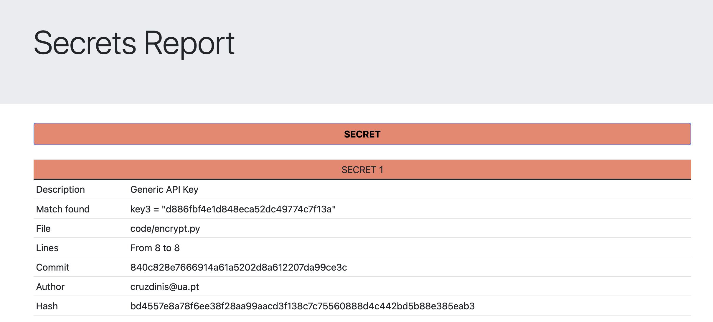

# Security pipeline secret detection documentation
This document will serve as documentation for the secret detection part of the pipeline

## Author
	Dinis Cruz

## Objectives
Catch secrets within the code

## Tools considered
When doing the initial tools research, the objective was always to create the most versatile solution possible. This versatility would come from being as easy to maintain as possible and preferably using open source solutions.

### Github secret scanning
This is GitHub's own secret detection tool, the integration with GitHub is obviously very helpful when it comes to user friendliness but as a recurring theme it cannot be used in private repositories.

### GittyLeaks
A simpler tool that can be used to find almost anything that remotely resembles a password or key, which will lead to a lot of false-positives.
This tool is like a beginners guide to secret detection, unfortunately the amount of false positives is too vast to ignore, anything that has certain key words will be flagged.

### GitGuardian
Possibly one the most used solution a part from GitLeaks, this solution is more used at an enterprise level with a user interface for management of multiple GitHub repositories with constant scanning tools. Considering the need to maintain this at the GitHub level and the added unnecessary complexity this tool was distracted.

### Detect secret
Open-source solution that has the mindset of preventing new secrets from entering a code base, this solution is however more oriented for pre-commit hooks, meaning every developer would have this tool to prevent commits from adding secrets.

### GitLeaks
Possibly the most standard tool, already with control to use in a git action, very configurable to add regex patterns.
This tool has the added capability of being able to detect secrets within GitHub's repository history, if even one commit has a secret associated, that can be found and the secret removal process can start.

## Proposed solution
Gitleaks seemed the best tool for the job, with the added bonus of scanning the whole repositories' history. Unfortunately the way to ignore secrets did not seem the most ideal so, as will be explained latter, this option was adapted.

## Job description

- Install GitLeaks
- Run it against the repo's history
- Summarise findings using the SecretsReporting.py script

## Auxiliary scripts
### InstallAndRunGitleaks.sh
Shell script that will:

- Clone the Gitleaks repository 
- Install Gitleaks from source
- Run Gitleaks against the repository
- Summarise the findings with the SecretsReporting.py script

### SecretsReporting.py

A python script that takes the first argument as a json file and summarises the reports found in the Gitleaks run a html file, as a second argument the file of secrets to ignore which contains the hashes of secrets to ignore and as thrid argument the place from where it can find it's jinja2 template.

This script will:

- Read the report and the secrets to be ignored
- Delete the date in each secret found to not mess with hashing
- Hash every secret
- If the hash is within those to be ignored then output it as an accepted secret if not flag it as a secret found
- Output the secrets to a html file
- Return 1 if any secret was found | Return 0 if no secret was found (Or only accepted secrets)

## Ignoring secrets
If at any point we get a false positive the SecretsReporting.py script will output a hash in every secret, taking that hash and adding it to the IgnoredSecrets.txt will make it so the next run wont block the workflow.

## Example output

