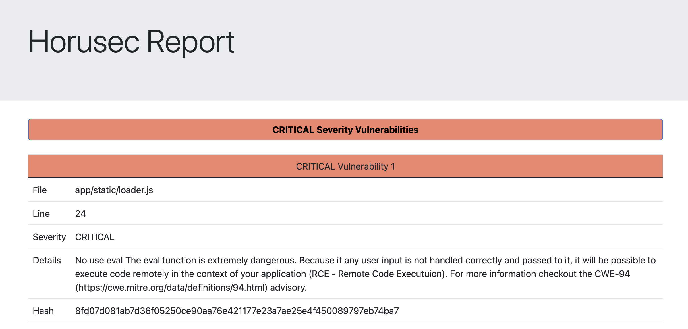

# Security pipeline vulnerable code and dependencies documentation
This document will serve as documentation for the vulnerable code and dependencies part of the pipeline

## Author
	Dinis Cruz

## Objectives
Catch higher level problems within the code and it's depedencies

## Tools considered
When doing the initial tools research, the objective was always to create the most versatile solution possible. This versatility would come from being as easy to maintain as possible and preferably using open source solutions.

### Sonarqube, codacy and CodeQL
These tools have been described in the Bad practices section of the pipeline and the reasons they are not used follow the same lines already described.

### Snyk
Comercial solution that offers vulnerability scanning in code and the dependencies of a project. The database used for the dependency scan is very large and well documented leaving a fantastic output while offering potential fixes if we wish. The code scanning part showed the expected results and didn't diverge from other tools but showed nothing special.

This is a comercial solution and with 200 dependency scans and 100 code scans can be sufficient for most projects.

### Horusec
An open source solution that is a compilation of well known tools. These are (For python):

	Bandit 
	Safety 
	Semgrep
	Owasp Dependency Check (v2.2)
	Trivy

The code scanning capabilities are in par with snyk and the most problematic dependencies tested were found by horusec also.

From the small testing sample used this tools looks like an open-source version of snyk, when considering only the scanning aspects, snyk being a comercial solution offers a better interface to be used and more diverse plans and options for enterprises. This is not exactly true when it comes to dependency scanning as snyk showed much more vulnerabilities found, these were of low severity but there can be no denying the the range it offers is amazing.

### Dependabots
This is GitHub's integrated solution for dependency checks, this offers a monitoring capability that the tools above do not, it can be ran from time to time looking for dependency problems and creating pull requests with possible fixes. The small steps it needs for configuration and the monitoring capabilities makes this tool a no brainer when it comes to enabling it or not.

## Proposed solution
Horusec can be ran indefinitely so adding it to the pipeline has no costs, however, with snyk's more broad output when it comes to dependency problems, it can interesting to having a horusec run on every pull request or pushes to other branches but when merging to main we can have a snyk run to create redundancy on possible problems. This is all rounded up with interval dependabots checks.

## Job description

- Download and install the tool within the github worker
- Run the tool with a json output
- Use of the HorusecReporting.py script to create a summarised version of the outputs that is useful for developers

### Dependa bots
Dependa bots are easily configurable, they only take a few clicks within the github interface to setup.

	On the github repo:
	
	Settings > Code security and analysis > Dependabots alerts --> enable

With this active security issues will apear in the security tab of the repository with the bot alerting to problems within dependencies.

We can configure the bot to create pull requests about version updates with a dependabot.yml file within the .github folder

This file will tell the bot when to scan and create these pull requests

[dependabot.yml config](https://docs.github.com/en/enterprise-server@3.4/code-security/dependabot/dependabot-version-updates/configuration-options-for-the-dependabot.yml-file)

#### Example file of a pip scan that happens daily at 11:59 am

```
version: 2

updates:

	# Maintain dependencies for GitHub Actions
	
	- package-ecosystem: "pip"
	
	  directory: "/"
		
	  schedule:
		
		interval: "daily"
		
		time: "11:59"
```

## Auxiliary scripts
### InstallAndRunHorusec.sh
Shell script that will: 

- Install horusec from source
- Run the horusec command outputting the result to a json file
- Run the HorusecReporting.py script to summarise the results from above to html
- Return the return code from horusec to pass or fail the job

### HorusecReporting.py

Following the same formula, this script will parse the json output from the horusec run and summarise the results in a html file

This script will:

- Read the data from the file passed as argument
- Output for each vulnerability
	- The file where it was found
	- Line where it was found
	- Severity
	- More details (A description of the vulnerability)
	- Hash of the vulnerability (For possible ignoring)

## Ignoring issues
Horusec hashes all found vulnerabilities and as seen above the config file can be used to ignore these vulnerabilities:

	- horusecCliRiskAcceptHashes
	- horusecCliFalsePositiveHashes

The [config file](https://docs.horusec.io/docs/cli/commands-and-flags/) offers a lot of options but most are in relation to the usage of the web tool, which is not the case with this project.
The most important configurations are (within the horusec-config.json file):
	- horusecCliReturnErrorIfFoundVulnerabilit: True or False and matters to indicate if we wish to fail the workflow if a vulnerability is found
	- horusecCliRiskAcceptHashes: Hashes of vulnerabilities that we have accepted the risk, this is the way to ignore vulnerabilities to stop them from appearing in the output
	- horusecCliSeveritiesToIgnore: What severities do we want to ignore, the default is INFO but we can for example ignore LOW
	- horusecCliFilesOrPathsToIgnore: We can chose paths to be ignored when checking for vulnerabilities
	- horusecCliFalsePositiveHashes: Similar to the risk accept hashes but these will be classified has being false positives (non vulnerabilities)

## Example output




