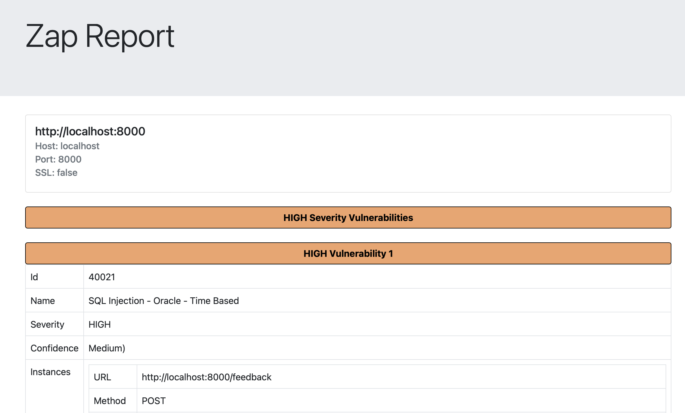

# Security pipeline dynamic analysis documentation
This document will serve as documentation for the container scanning part of the pipeline

## Author
	Dinis Cruz

## Objectives
Catch potential problems within docker instances

## Tools considered
When doing the initial tools research, the objective was always to create the most versatile solution possible. This versatility would come from being as easy to maintain as possible and preferably using open source solutions.

### Comercial solutions (sysdig and aqua security e.g)
These solutions seem to offer more than we need with full dashboard and configuration options for entire enterprises, considering we are only looking for a somewhat simple dynamic analysis on our container this seems like an over kill. It was not tested if results would change in terms of better reporting quality (Quantity of vulnerabilities that actually exist) but it is hard to believe that a open source community driven solution would not produce similar results considering vulnerability catching and reporting is a community effort.

### Openvas-scanner 
Tool better oriented for dashboard management, it is not a comercial solution but does not seem easy to integrate with GitHub as features and reports are shown within a dashboard and the tool is oriented that way.

### Jaeles
Command line tool that scans a certain host for problems specified in signatures, this means that it could be optimised to only run against what we want to test. 
Some basic tests using a vulnerable flask app did not show promising results with false positives and missing small miss configurations. It is an interesting tool but latter options explored just did what Jaeles did better.

### Nikto
Good for detecting outdated software and servers, found many false positives if it is expecting a 404 and gets a 200 response.

### OWASP ZAP
This is the most widely used web app scanner, it has been around for over a decade, always maintained by the community and for the community. The level of collaboration to build a tool like this can not be compared with anything, it is by fart the best option for our objectives and with our limitations. Being built on top of the [OWASP Top Ten](https://owasp.org/www-project-top-ten/) it will always find problematic vulnerabilities.

## Proposed solution
Having OWASP ZAP as the most complete tool, it is not flawless ,and focusses on the OWASP Top Ten which are the most critical and common problems.

## Workflow description 
### OWASP Zap

- Build the image from the docker file (This step can be adapted, the image just needs to be built)
- Run the image locally (Again this step can be adapted, the container just needs to be running)
- Use the OWASP Zap docker image relation ot the full scan to run the tool against the target
- Summarize reports using ZapReporting.py

## Auxiliary scripts
### InstallAndRunZaproxy
Shells script that will:

- Create the volume for the zap docker container (Allows for file reporting)
- Run the owasp docker full scan against the target specfied
- Summarise the reports using the ZapReporting.py script

### ZapReporting.py

- Read from the first file passed as an argument
- Organize and summarise information
- Present relevant information to a html file

## Notes

- Yes Zap does already offer a github action with a full scan, to try and keep things homogeneous this part of the pipeline pretty much mimics [their action](https://github.com/zaproxy/action-full-scan)

- Yes Zap does already offer html reporting, why do it again? Again being for homogeneous purposes and for comodity on having the option to collapse problems.

## Ignoring issues
OWASP Zap can be configured using his [config file](https://www.zaproxy.org/docs/docker/baseline-scan/#configuration-file)

## Example output
